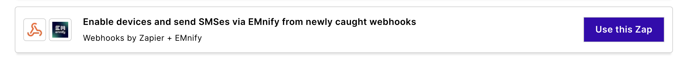

# Set up a Zapier SMS integration

Instead of implementing the APIs in your application, emnify and Zapier provide a no-code alternative to automate SMS workflows.
Zapier has a concept of triggers and actions—when a trigger happens, multiple actions can be based on it—taking content from previous steps.

Sending SMS to your devices is available as an action in Zapier.
Follow these steps to configure this integration via the emnify Portal:

1. [Log in to your emnify account](https://portal.emnify.com/sign).
1. Navigate to **Integrations**&nbsp;> [**No-Code-Workflows**](https://portal.emnify.com/integrations#no-code-workflows)
1. Find the integration you want to set up, then click **Use this Zap**.

There, you'll find a predefined Zap consisting of three steps with interactive instructions on configuring or modifying the steps for your specific needs.
For example:

1. Catch hook in webhooks by Zapier (Trigger)
1. Enable a device in emnify (Action)
1. Send an SMS in emnify (Action)

:::tip
For more detailed instructions, see Zapier's [How to connect emnify + SMS by Zapier](https://zapier.com/apps/emnify/integrations/sms) guide.
You can also learn more about [no-code workflows in the emnify Portal](/portal/no-code).
:::
