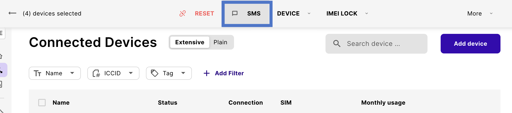

# SMS

Short Message Service (SMS) uses the same basic technology on IoT devices as that employed with consumer mobile devices.
However, in the context of IoT devices, there are more modes of SMS operation and use cases that provide additional capabilities.

## SMS P2P

Peer-to-peer (P2P) SMS describes the mode of sending SMS from one device to another.

For IoT devices, this poses a security threat.
Anyone with the correct MSISDN can issue commands to the device since there isn't any built-in authentication process.

P2P also isn't suitable for IoT device use cases in which a device needs to update, interact, or transmit frequently because a device is limited to receiving only six SMS messages per minute in this mode.

## SMS A2P

SMS application-to-peer (A2P) describes the mode of SMS data exchange between a device and an application.
One example of this is [sending SMS using the emnify Portal](#send-sms-using-the-emnify-portal).

Unlike P2P, A2P lets you interact with _multiple_ devices using an application.
Because A2P SMS can be automated, you can interact with your devices at scale.
It also tracks messages, which enables you to see when a message has been delivered.

## SMS MO and MT

Because the costs of sending SMS from an IoT device are higher than the cost of receiving SMS, all SMS usage is logged as either [SMS MO](/glossary#sms-mo) (sent) or [SMS MT](/glossary#sms-mt) (received).

Using the [emnify REST API](#send-sms-using-the-emnify-rest-api), you can dispatch SMS MO from devices as HTTP `POST` requests toward a user-configurable URL.

To activate or deactivate SMS MO or MT for a group of devices, you can use the toggle switches in a new or existing **Service Policy** to which the devices are assigned.
See [Service Policies](/portal/device-policies#service-policies) for more details.

## Send SMS using the emnify Portal

You can use the [emnify Portal](https://portal.emnify.com/) to send and receive SMS messages to and from your devices.
Because SMS doesn't require a data connection, SMS is one of the ways you can configure the [APN](/glossary#apn) for [GPS trackers](/apn-configuration/gps-trackers) and [industrial routers](/apn-configuration/industrial-routers).

### Open the SMS console

Each device has an SMS console.
To open a device's SMS console, select its message icon.

  
From Connected Devices

  

  
From Device Details

  

  
Show the Device SMS console

  

### Send bulk SMS to multiple devices

## Send SMS using the emnify REST API

See [Sending and receiving SMS](/rest/sms-operations) in the [emnify REST API](/rest) documentation.

## SMS via Zapier

Navigate to the emnify Portal [**Integrations**](https://portal.emnify.com/integrations) under the **No-Code Workflows** to find a list of Zapier integrations.
In this list, there are two "Zaps" for getting you started with sending SMS from your devices.

- Send SMS via Twilio when new devices reach usage limits in emnify
- Send SMS messages when new devices reach usage limits in emnify

:::tip
Learn more about [no-code workflows in the emnify Portal](/portal/no-code).
:::

## SMS via SMPP

[Short Message Peer-to-Peer (SMPP)](/glossary#smpp) is a protocol that the telecommunication industry uses for exchanging SMS messages between short message service centers (SMSC) and/or external short messaging entities (ESME).
Telematics platforms, SMS services, and operators often use SMPP to enable sending SMS to and from devices.

You can [select and configure SMPP](/portal/device-policies#smpp-sms-interface) as your **SMS Interface** via a new or existing **Service Policy** under [**Device Policies**](https://portal.emnify.com/device-policies).

:::tip
For an example of integrating SMPP with a third-party application, see [emnify SMS via SMPP integration with Gurtams' flespi and Wialon](https://www.emnify.com/integration-guides/smpp-integration-flespi-wialon-gurtam).
:::
