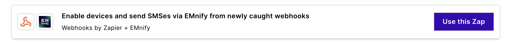

# SMS

Short Message Services (SMS) were one of the first cellular services made available after voice.
SMS is still very relevant for IoT use cases—as SMS provides an inexpensive way to configure the device remotely without the need for a data connection.
A typical use case is the configuration of the APN setting via SMS.

The emnify platform supports:

- Mobile originated (MO) SMS - SMS sent from the device with the emnify SIM
- Mobile terminated (MT) SMS - SMS that are destined for a device with the emnify SIM
- Peer-to-Peer (P2P) SMS - SMS sent from a device with any SIM to a device with the emnify SIM
- Application- to-peer (A2P) SMS - The SMS is sent and received on an application

The preceding scenarios can be activated and deactivated in the device policies to prevent misuse (for example, P2P SMS).

You can send and receive SMS of your devices through three different interfaces:

- [emnify Portal](#emnify-portal)
- [emnify SMS API and webhook](#emnify-sms-rest-api-and-webhook)
- [Zapier SMS integration](#zapier-sms-integration)

## emnify Portal

On the [**Connected Devices**](https://portal.emnify.com/connected-devices) page of the emnify Portal, you can access the SMS console and directly send SMS to the devices.
The sender can be configured as well as the console shows if the SMS is delivered or not.
You'll see all SMS that the device receives sends out.

For sending SMS messages to a single device, select **Details**:

An SMS/Message icon appears to the right of the device name.

The SMS history and input field at the bottom of the SMS console is similar to the layout and features found in most mobile messaging apps.

When you select one or more devices in the list of [**Connected Devices**](https://portal.emnify.com/connected-devices), a group of menu items appear that includes **SMS**.

This SMS interface doesn't show a history of messages.

However, you receive a brief notification regarding the status of the SMS sent to the selected devices.

## emnify SMS REST API and webhook

For sending SMS through the REST API, check out the [Send and receive SMS](/rest/sms-operations) guide.

For receiving SMS and delivery notifications for SMS in your application, you can use the SMS webhook.
To configure the webhook, go to the [**Device Policies**](https://portal.emnify.com/device-policies) page.
Under **Service Policies**, choose the policy you want to update and click **Details**.
Then, find the **SMS Interface** section.

Select **Webhook**, then select **Configure Webhook**.
In the **Add Webhook** dialog, provide the webhook URL and an optional secret key:

When you want to send an SMS from the device to your application, your device should send the SMS to an invalid [MSISDN](/glossary#msisdn) with eight digits or less.
The SMS is then delivered over the webhook.

<figure>
  
  <figcaption>
    <em>
      Delivery notification as received in Make (Integromat) webhook for SMS with ID: 46638644
    </em>
  </figcaption>
</figure>

<figure>
  
  <figcaption>
    <em>
      Mobile originated SMS from the device as received in Integromat webhook
    </em>
  </figcaption>
</figure>

## Zapier SMS integration

Instead of implementing the APIs in your application, emnify and Zapier provide a no-code alternative to automate SMS workflows.
Zapier has a concept of triggers and actions—when a trigger happens multiple actions can be based on it—taking content from previous steps.
Sending SMS to your devices is available as an action in Zapier.
In the [**No-Code-Workflows**](https://portal.emnify.com/integrations#no-code-workflows) list on the emnify Portal **Integrations** page, select the following:

There you'll find a predefined Zap consisting of three steps with interactive instructions on how to configure it or modify the steps for your specific needs:

1. Catch Hook in Webhooks by Zapier (Trigger)
1. Enable a Device in emnify (Action)
1. Send an SMS in emnify (Action)

See also Zapier's [How to connect emnify + SMS by Zapier](https://zapier.com/apps/emnify/integrations/sms) guide.
