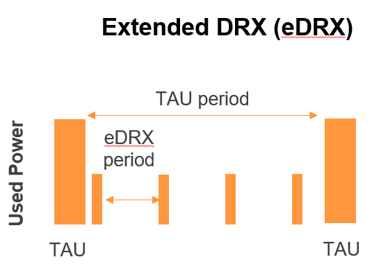

# Global IoT Network

<!-- markdownlint-disable MD040 -->

Even when IoT devices are primarily deployed at a single location and remain stationary, it's essential for a vendor serving multiple countries to adopt a global connectivity solution. This approach eliminates the need to maintain different SIM cards in stock or manage multiple contracts and data plans.

<!-- TODO: Find place for service_stack.png -->

## Mobile network aggregation

emnify uses an approach to aggregate the roaming footprint of multiple operators with the goal of providing access to every network worldwide.
Mobile operators utilize roaming services in foreign countries to ensure their subscribers can stay connected when traveling.
However, these operators often lack roaming agreements with all countries or may only have an agreement with only one network, which is suitable for roaming travelers but not ideal for devices that could be located anywhere within the country.
emnify collaborates with multiple partner operators worldwide  to expand its network coverage at a commercially viable rate.
The emnify [multi-IMSI applet](/services/global-iot-sim#multi-imsi-applet) enables devices to identify which roaming agreement with which operator is currently in use, ensuring transparent connectivity.

## Radio access types

The emnify IoT SIM and platform supports all devices and modules using the following radio access technologies:

<div align="center">
  
| Type  | Details                |
| ----- | ---------------------- |
| [2G](#2g-gsmgprsedge)  | GSM/GPRS/EDGE          |
| [3G](#3g-umtswcdmahpsahsdpa)  | UMTS/WCDMA/HPSA/HSDPA  |
| [4G](#4g-ltelte-alte-catxx)  | LTE/LTE-A/LTE-CATXX     |
| [5G](#5g-new-radio)  | New Radio               |
| [LTE-M](#lpwan-lte-mnb-iot)  | CAT-M1                 |
| [NB-IoT](#lpwan-lte-mnb-iot)  | CAT-NB1, CAT-NB2       |

</div>

For a device to establish a connection with any of these radio technologies, two essential conditions must be met:

1.  The network must support the specific radio technology.
2.  The device must be compatible with the network-specific frequency band associated with this technology.

These conditions are crucial for enabling seamless communication between devices and networks across various radio technologies.

### 2G (GSM/GPRS/EDGE)

GSM/GPRS remains one of the most prevalent IoT technologies.Despite its throughput ( with GPRS max. at 120kbps and EDGE at max. 1Mbps), it proves more than adequate for many IoT use cases.
The affordability of modules (costing less than $10) and the widespread coverage available in over 200 countries contribute to its enduring popularity.

Deploying GSM/GPRS for IoT use cases is relatively straightforward because operators worldwide utilize only four frequency bands:

<div align="center">
  
|     | frequency band |
| --- | --- |
| in the Americas | - B2 (1900MHz) <br/> - B5 (850MHz) |
| in the rest of world | - B3 (1800MHz) <br/> - B8 (900MHz) |

</div>

A a result, module manufacturers offer dual-band modules that can be used either in Americas or Rest of World. Alternatively, quad-band modules are available for global deployment.

However, it's important to note that GSM/GPRS is gradually being phased out in several countries to make room for newer technologies.
[More than 60 networks have discontinued or announced to discontinue GSM technology](https://www.emnify.com/en/resources/global-2g-phase-out).

### 3G (UMTS/WCDMA/HPSA/HSDPA)

3G technologies such as UMTS, WCDMA, HSDPA, and HSUPA have emerged in response to the growing demand for higher data speeds.
These technologies build upon the foundation of GSM, with many components of the GSM/GPRS core network and signaling being reused, with the most significant differences occurring in the radio component.

Similar to 2G, deploying 3G modules is a relatively straightforward process since operators worldwide utilize only five different frequency bands (with the exception of Japan and China).
This means that most UMTS modules can be deployed globally.

The frequency bands used include:

|  frequency band   |  |
| --- | --- |
| B1 (2100MHz) | the primary UMTS band worldwide | 
| B2 (1900MHz) | used in the Americas |
| B4 (1700MHz) | used in the Americas |
| B5 (850MHz)  | used in Australia and the Americas |
| B8 (900MHz) | used in Europe |

For deployment in Europe, a dual-band module supporting 900/2100 MHz is required, while for the Americas, a dual-band module supporting 850/1900 MHz is necessary.

It's important to note that 3G/UMTS is also undergoing phase-out by several network operators to accommodate newer technologies.
For more information, see the article on [GMS and UMTS networks that are being discontinued](https://www.emnify.com/en/resources/global-2g-phase-out).

### 4G (LTE/LTE-A/LTE-CATXX)

LTE, short for Long-Term Evolution, is a 4G technology (another one would be WiMAX - which never succeeded).
LTE has evolved over time, resulting in various LTE categories, including CAT-1, CAT-3, CAT-4, CAT-6, CAT-9, and CAT-12.
Each successive category delivers higher data throughput compared to its predecessors.

For consumer phones and broadband applications, the increased throughput is significant.
However, the increased module costs prompted the development of lightweight LTE modules tailored for IoT use cases.
This development ultimately led to CAT-1 emerging as the preferred LTE category for IoT applications.
 
LTE CAT-1 offers very impressive data speeds, providing 10Mbps in the downlink and 5Mbps in the uplink.
It is available with network operators wherever LTE is deployed.
Thanks to its widespread availability and the ability to roam between operators without limitations, LTE CAT-1 stands out as the most common choice for IoT use cases.

Deploying LTE devices on a global scale is more challenging compared to GSM and UMTS, primarily because network operators worldwide utilize over 27 different frequency bands.
Consequently, most modules are designed to support specific regions where devices can be deployed effectively.

Some main LTE-bands used are

|  frequency band   |  |
| --- | --- |
| B3 (1800 MHz) | used in Europe, Africa and APAC | 
| B7 (2600 MHz) | used in the Americas, Europe and APAC |
| B20 (800 MHz) | used in Europe and Asia |
| B1 (2100 MHz)  | used in Europe and Asia |
|  B2 (1900 MHz) | used in the Americas |
|  B4 (1700 MHz) | used in the Americas |
| B5 (850 MHz) | used in North America and APAC |

:::tip
Validate the frequency bands utilized by the operators in your deployment countries before deciding on a module.
:::

### LPWAN: LTE-M/NB-IoT

Both NB-IoT (Narrowband IoT) and LTE-M (Long-Term Evolution for Machines) are integral components of 5G standardization, while leveraging LTE infrastructure.
Both technologies have been specified to address the requirements for IoT use cases in terms of:

| Requirements | Details |
| --- | --- |
| Reduced cost | enables mass production of cellular IoT devices <br/> - by removing unnecessary LTE features for IoT such as dual carrier, high modulations |
| Low power utilization | for battery powered use cases that require years of operation <br/> - by introducing power saving features such as [PSM](#power-save-mode-psm)* and [eDRX](#extended-discontinuous-reception-edrx)** <br/> - by reducing the max. transmission power to less than 200mA to cater for battery max. current (GSM for example has 2A max power) |
| Wider coverage <br/> <sub><sup>(+14 dB for LTE-M and +20 dB for NB-IoT sensitivity)</sup></sub> | for rural/indoor/underground use cases <br/> - by utilizing extended coverage feature with more retransmissions to ensure data gets delivered |
| Smaller module size | enables smaller device use cases |

LTE-M and NB-IoT, relying on LTE infrastructure, are deployed across numerous frequency bands, with a total of 26 bands specified for their use.
To enable deployments in multiple countries and regions, the modules need to support the specific frequency bands allocated by operators.

Cellular LPWAN modules are available in different versions:

- NB-IoT only or LTE-M only
- LTE-M/NB-IoT combined
- LTE-M/NB-IoT with 2G fallback and optional additional technologies (3G, 4G)

As of today, NB-IoT  roaming is limited between operators due to the implementation of new charging models.
LTE-M roaming typically works over regular LTE roaming.
However, some operators may restrict access to their LTE-M networks and available features such as PSM and eDRX.

Check the emnify [LTE-M coverage](https://www.emnify.com/lte-m-coverage) and [NB-IoT coverage](https://www.emnify.com/nb-iot-coverage), availability of PSM/eDRX and proposed frequency bands on the emnify website.

#### Power-Save-Mode (PSM)

Why is cellular communication not ideal for IoT?

Traditional cellular communication for smartphones is designed to deliver low latency on the downlink, for example, ensuring that when you receive a call, your phone rings promptly.
However, this design involves two power-consuming tasks for the device:

  1. Continuously listening to the radio for incoming calls.
  1. Transmitting location information to the network. especially when it moves out of a tracking area and periodically every 54 minutes.

How does **Power Save Mode** work?  

For most IoT use cases a downlink-initiated channel isn't required.
Typically, it's the device that initiates the communication to transmit data, such as sensor readings.
Therefore, a **Power Save Mode** is introduced, allowing the device to enter a low-power sleep state when it has no data to send.

The **Power Save Mode** has the following characteristics:  

- **Lower Power Consumption:** During the Power Save Mode the module only consumes a couple of microamperes(μA).
- **Configurable Timing:** The device informs the network about how long it will periodically enter into PSM (timer T3412 extended).
- **Inaccessible in Downlink:** The device/module isn't reachable from the outside during PSM in the downlink.
- **Wake-Up Capability:** The device can wake up the module and transmit data using methods such as pressing the power key, triggering an interrupt or pin).
- **No Need For Reattachment:** After waking up, the device doesn't require reattachment or the reestablishment of a Packet Data Network (PDN) connection, unless it has moved to a different tracking area.
- **Idle Mode Afer Wake-Up:** After the wake-up, the device remains in idle mode for a configurable time (timer T3324) to listen for downlink messages, such as firmware updates.
- **Effective Time Calculation:** The actual duration the device spends in Power Save Mode is calculated as T3412 extended minus T3324.

<!-- This is the "alt" text for a missing image: "PSM and the 3412 and T3324 timers" -->

:::note
Some modules which use a SIM enabled PIN, such as u-blox SARA-R4/SARA-N4, don't enter sleep mode.
However, the PIN is disabled on emnify SIMs.
:::

Roaming for Power Save Mode

It's important to note that not all NB-IoT and LTE-M networks have implemented PSM and even when PSM is available with the local operator this doesn't mean that a roaming SIM can use it.
This makes it difficult for devices that are moving, as they may encounter networks that don't support PSM or use different timer configurations. 
emnify regularly tests the availability of PSM within the [LTE-M](https://www.emnify.com/lte-m-coverage?hsLang=en) and [NB-IoT](https://www.emnify.com/nb-iot-coverage) roaming footprint.

AT Command calculation and examples for PSM settings
  
The 3GPP defined AT command for configuring PSM is `AT+CPSMS`, which sets the T3412 extended and T3324 timers.
  
Here's an example command:

```
AT+CPSMS=1,,,01001110,00000101
```

In this example, PSM is enabled (1). 
The desired value for T3412 extended is set to 140 hours (01001110), and the desired value for the T3324 timer is 10 seconds (00000101). 
The network may not necessarily use the exact desired values but will select supported values that are close to the desired ones.

To read the effective PSM configuration, you can use the command:

```
AT+CPSMS?
```

There is a helpful calculator available from [Thales](https://www.thalesgroup.com/en/markets/digital-identity-and-security/iot/resources/developers/psm-calculation-tool) that translates intended time settings for 3412 and T3324.

Module vendors have also implemented module specific commands. For example, Quectel offers:

- `AT+QPSMS`: Extends PSM settings.
- `AT+QCFG=”psm/enter”,1`: Puts the module immediately into PSM when the RRC connection is released, without waiting for T3324 to expire.
- `AT+QPSMEXTCFG`: Modem optimization command with different attributes, such as ensuring that PSM is randomized among different devices to avoid sending data simultaneously.

#### Extended Discontinuous Reception (eDRX)

How does eDRX work?  

While PSM focses on uplink-centric use cases, eDRX aims to reduce the power consumption for IoT scenarios that involve receiving downlink information.
Unlike regular smartphones, which don't continuously listen to the radio for incoming messages, IoT devices often use a technique called DRX (Discontinuous Reception).
In DRX, they only wake up periodically, for instance, every 1.28 seconds or 2.56 seconds.

eDRX extends this concept by allowing the configuration of custom intervals, ranging from 40 to 175 minutes, depending on what the visited network allows.

  

Roaming with eDRX  

Similar to PSM, not all NB-IoT and LTE-M networks support eDRX or the same timer configuration.
Even if they do, it doesn't guarantee that a roaming SIM card can utilize eDRX.
For this reason, emnify conducts tests and publishes the eDRX availability within our [LTE-M](https://www.emnify.com/lte-m-coverage?hsLang=en) and [NB-IoT](https://www.emnify.com/nb-iot-coverage) roaming footprint.

AT Command examples for eDRX settings

The standard 3GPP-defined AT-command for configuring eDRX is `AT+CEDRXS`.  
  
Here's an example command that enables eDRX for LTE-M (4) with an eDRX cycle of 143.36 seconds (1000):

```
AT+CEDRXS=1,4,"1000"
```

For NB-IoT, you would use 5, and the timer values are shown in the following table:

| Binary  | Timer Value      |
| ------- | ---------------: |
| 0 0 0 0 |     5.12 seconds |
| 0 0 0 1 |    10.24 seconds |
| 0 0 1 0 |    20.48 seconds |
| 0 0 1 1 |    40.96 seconds |
| 0 1 0 0 |    61.44 seconds |
| 0 1 0 1 |    81.92 seconds |
| 0 1 1 0 |   102.40 seconds |
| 0 1 1 1 |   122.88 seconds |
| 1 0 0 0 |   143.36 seconds |
| 1 0 0 1 |   163.84 seconds |
| 1 0 1 0 |   327.68 seconds |
| 1 0 1 1 |   655.36 seconds |
| 1 1 0 0 |  1310.72 seconds |
| 1 1 0 1 |  2621.44 seconds |
| 1 1 1 0 |  5242.88 seconds |
| 1 1 1 1 | 10485.76 seconds |

The network responds with the actual effective interval.

```
+CEDRXS: [4,"1000","1000","0111"]
```

### 5G (New Radio)

5G is the next major technology standard following LTE, which targets three main applications areas:

1. Enhanced Mobile Broadband (eMBB)  
    - It offers faster throughput up to 1Gps+ and more capacity in a local areas.
    - It utilizes millimeter-wave (MM wave) bands (5Ghz+) to archieve higher throughput.
1. Massive Machine Type communication (mMTC)  
    - Designed for IoT applications with a multitude of devices in close proximity, requiring low-power communication. 
    - LTE-M and NB-IoT are often seen as decoupled from 5G but may eventually integrate with 5G mMTC.
1. Ultra-Reliable Low Latency Communications (URLLC)
    - Aimed at mission-critical applications that demand low latency and reliable data transmission.

As of today, 5G is primarily adopted for eMBB use cases, using a 5G non-standalone (NSA) deployment. That means, that the air interface uses 5G technology whereas the core network remains 4G.

emnify has announced its first 5G roaming agreements in August 2020 and has since reached agreements with more than a dozen network operators worldwide.
