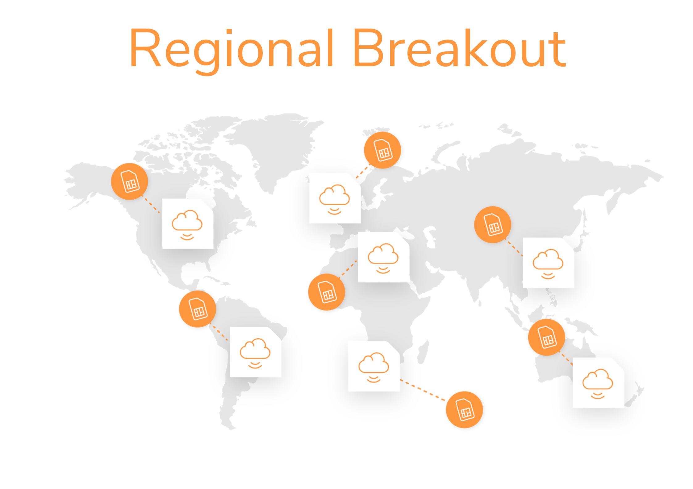

# IoT cloud communication platform

emnify’s platform (consisting of a mobile core network and a communication platform dedicated for IoT) has been built up cloud-natively.
Being deployed in three AWS cloud regions within 2-3 availability zones / data centers per region increases the availability of the solution—even when one cloud data center becomes unavailable, data is still transported over the emnify network.

## Distributed data plane

Traditional connectivity providers have a centrally located network core.
All data is backhauled to the home country of the operator which means that customer data travels across the globe and distributed latency optimized application infrastructure isn't possible.

## Traditional operators vs emnify

The data plane of emnify’s cloud communication platform is distributed across major cloud regions (Virginia/US, Ireland/Europe, Singapore/APAC) and directly connected to central peering points with the local operators.

## Regional breakout

emnify’s distributed data plane enables device data to breakout locally, keeping the customer data within the same region.
Moreover, it also helps reduce network latency.
You can either select a specific breakout region or the network automatically selects the breakout region closest to the device.
This can be done on the [emnify Portal](https://portal.emnify.com/).
On the [**Device Policies**](https://portal.emnify.com/device-policies) page, select **New service policy** which is applicable to a group of devices.
