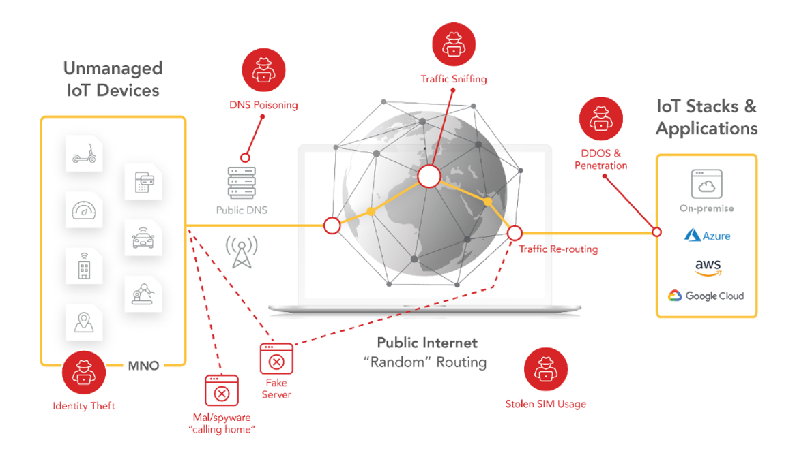

# Security

Given the globally distributed nature of the devices, smaller footprints and lack of resources, it can get difficult to individually secure IoT devices.

emnify uses a SASE approach to simplify securing devices—using several services specifically to protect customer data, filtering malicious content and preventing unauthorized access.

## Why does IoT require SASE?

Secure Access Service Edge ([SASE](/glossary#sase)) introduces a new architecture where networking and security functions are bundled in a cloud-delivered service.
This approach allows you to apply consistent security standards to all your devices independent of the location.
Additionally, it enables the integration of security features right from the start.

Key features of SASE for IoT architecture include:

- **Dynamic Data Routing with Software-Defined Wide Area Network (SD-WAN)**  
  emnify utilizes a SD-WAN to route data to the closest cloud region using the [Regional Breakout](iot-cloud-communication-platform#regional-breakout) concept.
  This enhances latency and data stability, ensuring that data remains within the designated continent and jurisdiction.
- **Cloud Access Security Broker (CASB)**  
  emnify offers centralized policy definition for devices, including networks that can be accessed and authorized IP addresses for remote device access.
  All configurations are managed through the central platform and applied wherever the device is.

## Security features

The following sections delve into some of the security features offered by emnify.

### DNS

When a device establishes a connection, it uses a Domain Name Service (DNS) server to resolve a hostname to an IP address for data transmission.
For example, a hostname like `iot.example.com` is mapped to an IP address like `192.0.2.1`.

Cellular providers typically provide DNS services.
By default, emnify routes all DNS queries over Google's public DNS `8.8.8.8`.

Some devices and modules allow you to configure the DNS service.
For example, Quectel uses the `AT+QIDNSCFG` command, while SIMCom uses the `AT+CDNSCFG` command.
Configuring the DNS service is beneficial for using your own or private DNS servers, enhancing security and control.

Customers can also configure to use their own DNS, no matter if it's a public or a private one.
For more information, see [Configure DNS settings](/how-tos/configure-dns-settings).

<!-- TODO: Recreate dns_setting.png (Custom DNS setting configuration) -->

### IMEI lock

Device manufacturers often face issues related to SIM card theft, as pluggable SIM cards can be removed from a device and then used to gain free internet access.
The IMEI lock feature prevents the use of SIM card in any other device by binding the SIM to a specific [international mobile equipment identity (IMEI)](/glossary#imei), which serves as a unique device identifier.

When the automatic IMEI lock is configured, the emnify platform binds the SIM cards to the first device that establishes a data connection.
All future device connections are restricted to this specific device.

### Multi-factor authentication

Starting January 2024, multi-factor authentication (MFA) will be mandatory for all emnify Portal accounts.
This enforcement allows us to proactively safeguard our IoT ecosystem, follow best practices, and meet regulatory security compliance.

For more information, see [Set up multi-factor authentication](/how-tos/multi-factor-authentication).
